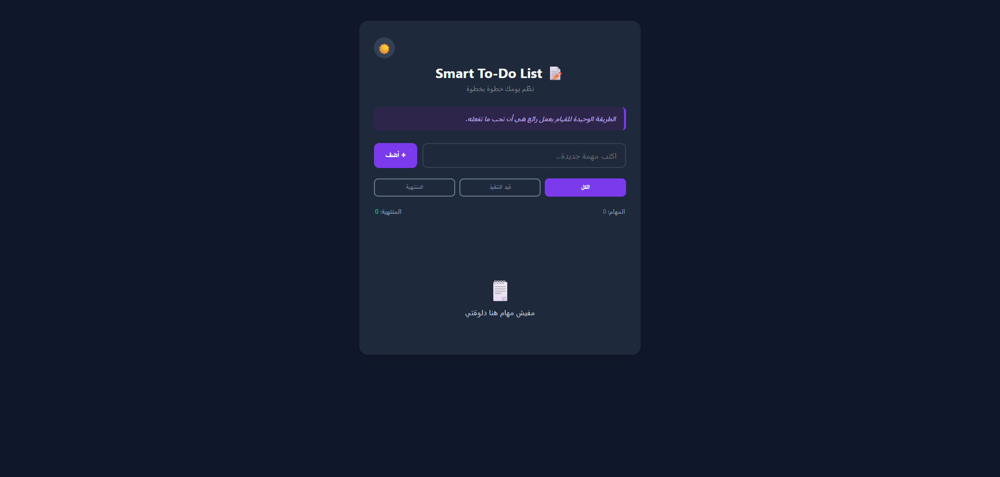

# 📝 Smart To-Do List

تطبيق لإدارة المهام اليومية بواجهة مستخدم عصرية وبسيطة، يهدف لمساعدتك على تنظيم يومك بإنتاجية عالية.



---

## 🌟 المميزات (Features)

- **الوضع الليلي (Dark Mode):** تبديل سلس بين الوضع الفاتح والمظلم لحماية العين.
- **حفظ البيانات (Persistence):** يستخدم `LocalStorage` لحفظ المهام حتى بعد إغلاق المتصفح.
- **نظام الفلترة (Filtering):** تصنيف المهام إلى (الكل، قيد التنفيذ، المنتهية).
- **اقتباسات تحفيزية:** عرض جمل تشجيعية تتغير بشكل عشوائي.
- **إحصائيات فورية:** عداد ذكي يوضح إجمالي المهام وما تم إنجازه منها.
- **متجاوب (Responsive):** تصميم مرن يعمل بكفاءة على الهواتف والأجهزة اللوحية والحواسيب.

---

## 🛠️ التقنيات المستخدمة (Technologies)

- **HTML5:** لبناء الهيكل الأساسي.
- **CSS3:** تم استخدام `CSS Variables` و `Animations` لتجربة بصرية ممتعة.
- **jQuery:** للتعامل مع الـ DOM والعمليات الديناميكية.
- **JavaScript (ES6):** لإدارة المنطق البرمجي وتخزين البيانات.

---

## 🚀 كيفية التشغيل (How to Run)

1. قم بتحميل المشروع (Download ZIP) أو عمل `Clone` للمستودع:
   ```bash
   git clone [https://github.com/II3boody/To-Do-list.git](https://github.com/II3boody/To-Do-list.git)
   ```
